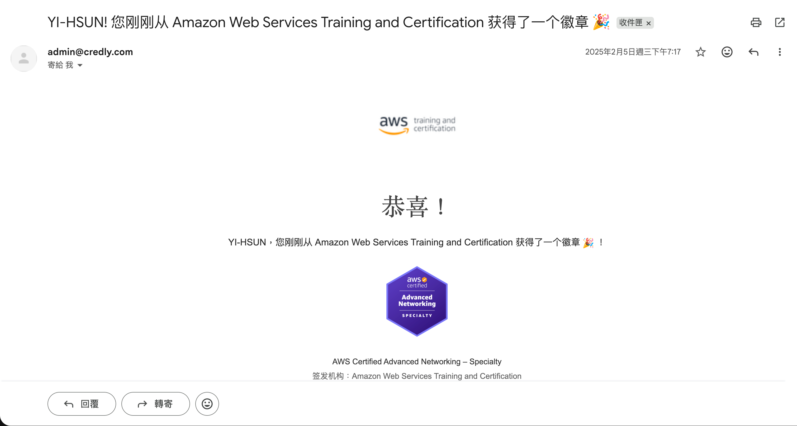
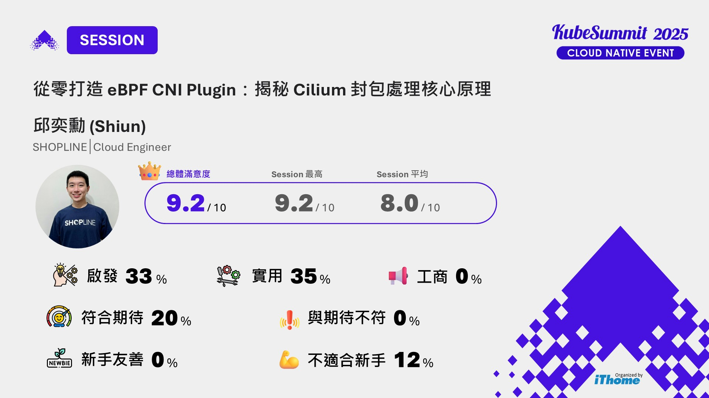
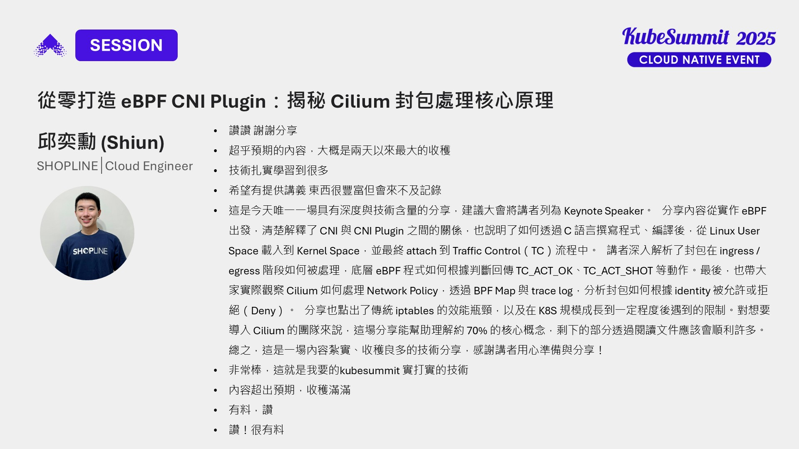
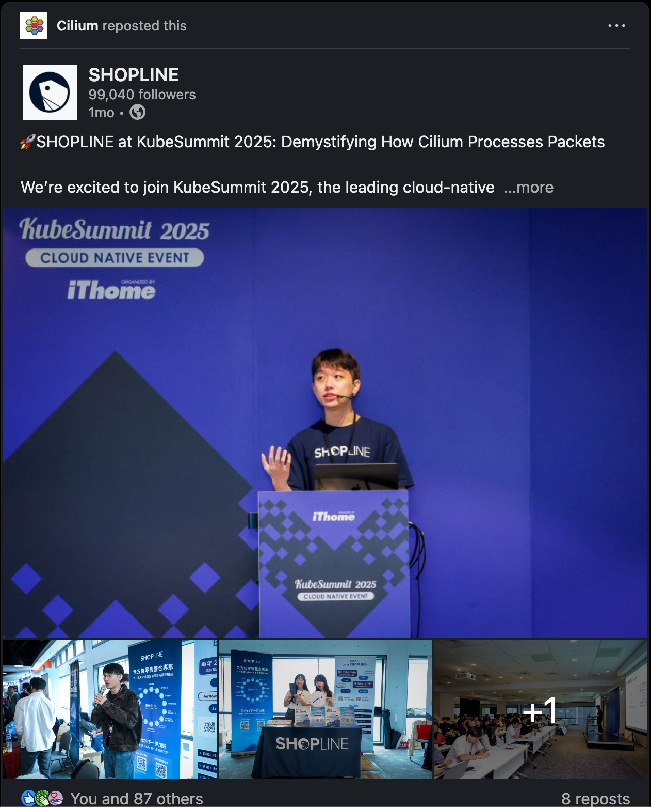
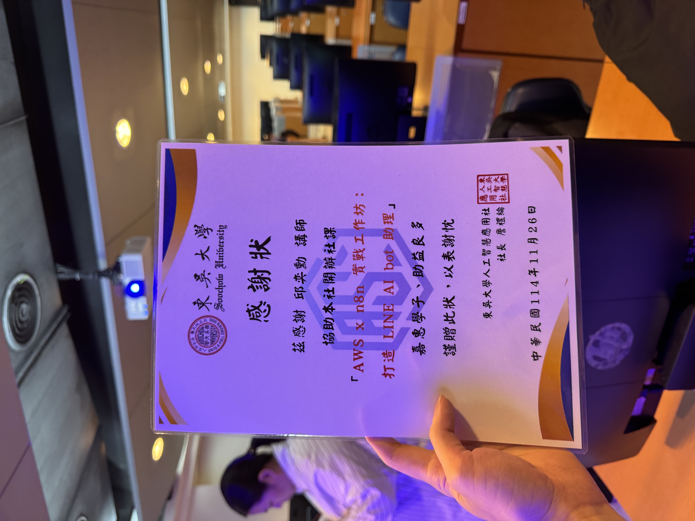

紀錄我 2025 年從剛當完兵、入職 Cloud Engineer、備戰雙十一，到站上技術舞台與拿下鐵人賽冠軍的完整一年。

## Summary

2025 年，我從剛當完兵、第一份正職工作開始，一路走到雙十一、技術舞台，還有寫作賽事

我在 Q1 成為 **SHOPLINE Cloud Engineer**，正式投入大規模電商系統的 Kubernetes 與 Networking 維運，涵蓋 EKS、CDN / Proxy Layer、TLS、以及高流量穩定性設計。入職後即被要求主講 **EKS Deep Dive** 內部分享，開始承擔雙十一備戰相關的系統責任。

Q3～Q4，我參與 **SHOPLINE 2025 雙十一** 的系統備戰與當晚 shift，並見證 SHOPLINE 業績再創新高。

在技術輸出與社群方面，我於 2025 年：

- 於 **2025** **KubeSummit**  代表 SHOPLINE 演講「[**從零打造 eBPF CNI Plugin：揭秘 Cilium 封包處理核心原理**](https://k8s.ithome.com.tw/2025/session-page/4083)」該場次為 **全場滿意度最高演講**，內容深入底層從 Cilium 原始碼與論文出發，實作 Prototype 解構封包處理流程，並得到 **Cilium 官方轉發**
- 首次參賽 **iTHome 鐵人賽（Cloud Native 組）獲得冠軍**，完成「[**30 天深入淺出 Cilium：從入門到實戰**](https://ithelp.ithome.com.tw/users/20178778/ironman/8746)」系列，深入淺出教學 Cilium 與實戰經驗
- 成為 [**AWS Community Builder（Serverless）**](https://builder.aws.com/community/@shiun)
- 並持續以 Mentor 身份參與 [**AWS Educate Cloud Ambassador**](https://www.instagram.com/awseducatestdambtw/?hl=en)，累積 10+ 場技術與職涯培訓課程

整體而言，2025 是我把 **Networking / Kubernetes / Cloud Infra** 從「深度學習」推進到「可被驗證輸出」的一年，無論是在大流量實戰、底層原理拆解，或對外技術傳播上，都開始累積出一條穩定的專業方向

---

## 怎麼比較少在發部落格文章？

一大部分原因是閒暇時間比較少，想做的事情、和自己的目標非常多，如果有讀者對我成長歷程有興趣，建議可以直接去看 [Notion](https://shiun.notion.site/Shiun-s-Learning-Journal-ded4cd4a3efd47b2805f2f99dee8f9a1?pvs=4)，我每天都會在 Notion 寫文章！

有比較多閒暇時間時就會來更新一下，像是現在我剛好休蠻多假就趁這時間來更新

---

## 2025 年 Q1 進入戰場

### 1 月｜退伍後，開始積極找第一份正職

24 年 12 月底退伍後，1 月對我來說算是一個正式切換狀態的時間點。

老實說，男生大學畢業後大多都會卡在等兵單這一關，我身邊也不少朋友跟我說，如果還沒當完兵就去找工作，實際上會比較難。所以在退伍後，我才真正開始認真投入找工作。

那段時間，一方面我持續在 AWS Educate Cloud Ambassador 裡面做事，另一方面也把大部分空檔拿來讀書，目標很明確，就是把 AWS Advanced Networking – Specialty 這張證照考下來。

---

### 2 月｜考到了 ANS 證照，找工作比想像中慢

過年前，成功考到 AWS 專家級證照 - [**AWS Certified Advanced Networking – Specialty**](https://aws.amazon.com/tw/certification/certified-advanced-networking-specialty/)

這張證照準備的時間其實不短，題目又長又複雜，但因為本來就很喜歡 Networking，整個準備過程對我來說反而是快樂的，也確實把很多網路相關的觀念再打磨了一次。

找工作的部分，進度就沒那麼快了…

並不是沒有工作機會，反而是我很清楚自己想要什麼，也因此變得很挑。我不是在找一份「可以做的工作」，而是在找一個我願意長期投入的方向。如果我自己都說服不了自己這份工作值得投入，那就算拿到 offer，我也不會開心。

> I’m not looking for a job. I’m looking for a career.
> 

所以 1、2 月那段時間，我幾乎每天都在看 104、LinkedIn、Cake，但真正投出去的職缺只有一個（不是 SHOPLINE）。隨著時間過去，心裡的焦慮感也持續上升

直到有一天，我在 LinkedIn 上看到 Andy Chung （是我現在的部門主管）發的一篇徵才文

那份 Job Description 我一行一行看完，裡面寫的內容，剛好完整對齊我想投入的方向。我那時候還把貼文轉傳到朋友群，直接跟朋友說，這個職缺真的超合我想要走的方向，公司文化也很契合，一定把握機會。後來我鼓起勇氣私訊 Andy，小聊了一下，沒想到就這樣拿到了面試機會。

**現在回頭看，那是 2025 年一個非常關鍵的轉折點**

> 很感謝 Andy 願意給我這寶貴的面試機會

---

### 3 月｜我成為 SHOPLINE Cloud Engineer 了

收到面試邀請後，我的心情其實很複雜… 當下除了開心之外、剩下就是超級無敵緊張，我不知道怎麼形容我這「超級無敵」，整個緊張成分包含：

1. 這是我第一場正職工作的面試，過往的面試經驗只有伊雲谷 Intern、AWS Educate Cloud Ambassador
2. 是等了很久才看到一個很符合自己期望的職缺，「我很害怕錯失這個機會」
3. 我的資歷尚淺，對於大型系統維運還沒有很豐富的經驗，我很害怕「技術面試什麼東西都答不出來」

簡單來說，有一種剛踏出新手村就要挑戰魔王副本的感覺。

面試細節就不在這裡細談 XD，如果有讀者對 SHOPLINE 職缺有興趣可以 Linkedin 找我聊聊

最後的結果是，我順利成為 SHOPLINE 的一份子，加入 Cloud Team 裡的 Platform 的小組，主要專注在 Infra, Networking 的領域，需要熟悉領域的技術：

- CDN / Proxy Layer
- SSL/TLS Certificates
- EKS  (在 K8s 裡面的組件很多，我們負責那些偏 Infra 的組件)
- 其他任何 Networking 相關的技術

整個 3 月幾乎都在高速學習，其中當時我有被要求準備內部的 EKS 分享，必須自己 Deep Dive 底層細節，再把內容整理給部門同事聽。這段時間的學習密度非常高，我從 Mao 和 Daniel 前輩的身上學到超級多，這也讓我很快進入工作狀態

> 順帶補充，SHOPLINE 有拍一個短影音叫做「[職場感謝祭](https://www.instagram.com/reel/DRlyec-Ea9Y/?utm_source=ig_web_copy_link&igsh=MzRlODBiNWFlZA==)」，我有幫忙拍，其中我最感謝的人就是 Mao Wang

---

### 3 月｜成為 AWS Community Builder

同一個月，我也收到 AWS Community Builder 的通知：我成為 AWS Community Builder 了！

我主要的貢獻是撰寫技術文章、開發 Serverless 應用和舉辦 Workshops，我的技術領域除了專注在 Networking, Container 之外，還有一個我也很熱愛的領域是 Serverless！我有數個 Side Project 都是用 AWS 的各個 Serverless 服務 Build 出來的，很榮幸我能在 AWS Serverless 領域也能貢獻一份心力。

> 詳細 Contributions 和 Projects 可以參考： [AWS Community Builder - My AWS Contributions](https://www.notion.so/AWS-Community-Builder-My-AWS-Contributions-17fea7e0d9d0804e9e94f196b667bc9e?pvs=21) 
另外，最近 2026 年的 [AWS Community Builders Program](https://builder.aws.com/community/community-builders) 也要在 1 月份左右開放申請了，如果也有人想要申請成為 AWS Community Builder 過程有任何疑問也歡迎 [Linkedin](https://www.linkedin.com/in/shiunchiu) 找我聊聊

另外提到「貢獻」，其實我目前仍以 Mentor 的身份參與 AWS Educate Cloud Ambassador，負責培訓現任大使。過去的一屆舉辦了 8+ 場課程，從那一屆大使身上得到回饋滿意度是 **5/5**，領域從 Serverless、Container、Networking、Project Management 到職涯分享都有，現在也持續在這個組織裡陪著新一屆的大使成長，培訓課程也持續增加中目前總累積已經 10+ 場課程了。

> 也希望如果讀者還是學生，不妨之後開放招募時也來申請看看，如果對於 AWS Educate Cloud Ambassador 這個組織有什麼問題我都很樂意 Linkedin 上面聊喔

---

## 2025 年 Q2 技術實力突飛猛進

### 4 月 ~ 6 月｜站穩角色，試用期通過

我是 3 月入職的，所以 4 到 6 月對我來說，就是全力把「Cloud Engineer 這個角色」站穩的階段

入職後，我給自己設定的第一個明確目標其實很單純：**試用期要通過**。這段時間我的技術能力確實成長非常多，一方面是工作內容本身就有足夠的深度，另一方面也很大程度來自於身邊的同事真的願意帶人。

而 SHOPLINE 作為目前台港市占率最高的 SaaS 線上開店平台（可以簡單理解成亞洲版 Shopify），對我來說有很多挑戰讓我很興奮，像是：我們組所負責的 OpenResty 就是在最前面扛大流量的組件、管理上萬張的 SSL/TLS Certificates、防禦 DDoS …

我自己其實也很在意一件事，就是實際入職後，這個職位是不是和當初投遞時的想像一致。畢竟身邊也聽過不少例子，職缺寫得很好看，但實際進去卻完全不是那回事。

以我自己的經驗來說，**SHOPLINE 的 Cloud Engineer 和我原本期待的角色是完全對得起來的**。我的日常工作確實圍繞在 Kubernetes、Networking 這些核心技術上，也能實際接觸到系統穩定性與 infra 層面的問題，實際日常工作中有很多問題都是要非常深入底層，而不是只停留在表層操作。

整個 4 到 6 月，我一邊熟悉既有系統，一邊補齊自己在大型系統維運上的不足。很多下班後的時間，其實也都拿來把工作中遇到的技術問題再深入研究，不是在加班 XD 是因為那些本來就是我自己感興趣的領域。

最終在 6 月，我順利通過試用期。對我來說，這不只是聘雇流程上的一個節點，而是一個很實際的訊號：**我已經能夠勝任這個角色的日常責任了**。

---

## 2025 年 Q3 備戰雙十一

### 7 月 ~ 9 月

通過試用期後，7 到 9 月我的工作重心開始更明確地放在備戰雙十一。

在電商產業裡，雙十一其實很像一個每年都會遇到的固定大考日。公司會有很清楚的共同目標，希望在營收創新高的同時，技術團隊也必須確保整個系統能夠穩定撐住流量。這段期間，系統會反覆進行各種壓力測試，也會一輪一輪檢視不同環節的風險。

工作的實際細節我不打算在這篇文章裡展開，但對我來說，這段時間最大的挑戰其實不是某一個特定技術，而是開始反覆思考一個問題：**如果雙十一真的倒站了，我當下可以做什麼？**

難的地方在於，系統本身非常龐大。當真的出問題時，不一定能第一時間就定位到問題點；即使找到了問題，接下來要思考的也不是「為什麼會壞」，而是「現在能不能先止血、怎麼緩解影響」。這種思考方式，和過去只專注在單一元件或功能的問題，其實是完全不同的層級。

也因為備戰雙十一的關係，我開始更有意識地從「整體系統」的角度去看事情，而不是只關注自己負責的那一小塊。

> 關於 SHOPLINE 怎麼備戰雙十一，推薦可以去看 SHOPLINE 的這個[短影音](https://www.instagram.com/reel/DROWBF6ks3S/?utm_source=ig_web_copy_link&igsh=MzRlODBiNWFlZA==)，裡面提到工程團隊、AM 顧問團隊、Admin 團隊各自如何備戰
> 

同一段時間，我們也開始面試[第 8 屆的 AWS Educate Cloud Ambassador](https://aws.amazon.com/tw/events/aws-educate-cloud-ambassador-8th/)。這對我來說算是一個蠻有趣的對比：一邊是在高壓的商業實戰場景，另一邊則是看到學生世代的技術趨勢。

在面試過程中，很明顯可以感受到 AI 已經是許多學生的日常工具，不只是會用，而是懂得怎麼拿來輔助學習與實作。有些作品甚至會讓人一瞬間忘記這是學生做出來的。對我來說，這也提醒了自己，技術環境變化的速度其實一直都很快，不能停在既有的舒適圈。

---

## 2025 年 Q4

### 10 月｜KubeSummit 全場滿意度最高講者、Cilium 官方轉發

_(60).jpg)

在 2025 KubeSummit，我代表 SHOPLINE 講了一場演講，主題是「 [**從零打造eBPF CNI Plugin：揭秘Cilium封包處理核心原理**](https://k8s.ithome.com.tw/2025/session-page/4083)」

靈感來自 Liz Rice 在 2018 年 GOTO Conference 的經典演講「[Containers From Scratch](https://youtu.be/8fi7uSYlOdc?si=UwelM98IKJa0cGK_)」，Liz Rice 透過 Golang 從零實作出一個容器，深入剖析其底層原理。

所以我也想把這精神延伸至 Cilium 領域——以 From Scratch 的方式打造一個 Cilium Prototype，帶領大家從底層角度「揭秘 Cilium 的封包處理核心原理」。

準備這場演講花了很長的時間，主要是因為我必須先真的「理解 Cilium」，而不是停在使用層。那段時間我花了大量時間看 Cilium 的原始碼，補齊底層網路相關的知識，也去讀了一些論文，確保自己不是只是在拼湊概念，而是真的知道每一段設計背後在解什麼問題。

最終，這場演講成為 **2025 KubeSummit 全場滿意度最高的一場演講**

我也很感謝每一位聽眾的回饋，其中有一個聽眾回饋寫得非常長、也非常具體，讓我知道這場分享真的有幫助到人深入底層學習 Cilium 的人

另外，也很開心這場演講的 [Linkedin 貼文](https://www.linkedin.com/posts/shopline_oiqkrtnprjtljpu-opglhlhvjlefjqwmvh-iwviozlrpltdjqekar-ugcPost-7394656674835267584-Erni?utm_source=share&utm_medium=member_desktop&rcm=ACoAADxpGXcB7_nqTUbN8m7BFbzen5Jk-G2Ka2o) 有被 Cilium 官方轉發，對我來說算是一個意想不到、很珍貴的肯定

---

### 11 月｜ 雙十一購物節 SHOPLINE 業績創新高

11 月最重大也最精彩的活動莫過於雙十一購物節

11/10 晚上，SHOPLINE 內部稱為「雙十一之夜」。這一天公司會特別調整排班，部分夥伴會從下午一路工作到 11/11 凌晨，而我正好被排在雙十一之夜的那個 shift。老實說，心情是有點興奮，但也帶著一點緊張和恐懼 XD 因為這是我第一次在這種等級的流量場景，站在第一線。

*👆 推薦大家可以去 Instagram 找 [shopline_careers](https://www.instagram.com/shopline_careers?utm_source=ig_web_button_share_sheet&igsh=ZDNlZDc0MzIxNw==)，然後查看「工作日常」精選動態，裡面有雙十一之夜的小影片，上面圖片是從精選動態截圖的*

雙十一之夜的核心目標其實只有一個：**確保系統在 11/10 跨到 11/11 的那個瞬間能夠穩住。**

所以雙十一之夜這天會有一段時間是要等到流量到高峰，這段等待期間 SHOPLINE 有準備晚餐、飲料、安排團康遊戲（有獎金）、宵夜和各種補給品（例如：提神飲料、雞精、零食），半夜沒有大眾運輸所以這天也能搭計程車回家然後向公司報帳

而我找 Cloud Team 的同事組一隊去玩團康遊戲，今年的遊戲是「中文怪物」和「猜人、猜物」：

- 中文怪物：投影幕上會出現一些生難字，我們要寫出注音，必須全對才給分，例如：題目是蛤蜊，那你就要在答題紙上面寫上「ㄍㄜˊ ㄌㄧˊ」，全部正確才得分
- 猜人、猜物：投影幕上會出現圖片，例如：會出現某個人物（可能會有 SHOPLINE 同事 XD）或是某個物品，要講出全名才得分

而我們這組有學霸（不是我）、也有在 SHOPLINE 工作超久的同事（如果沒記錯印象中已經待了 9 年），我們這組竟然拿了最高分，取得團康遊戲的第一名，拿到了獎金，好開心 XD

後續就是要等到 11/10 23:00 左右，SHOPLINE 全員就會開始進入備戰狀態，每個人都會就位，像是 Cloud Team、System Architect、PMO 還有高階主管會被分配在一間戰情室，確保系統出現異常時能夠直接在戰情室內迅速溝通並緩解線上狀況。

對我來說，這一晚真正的挑戰並不是某一個具體技術，而是「在高壓環境下，如何保持判斷清楚」。如果系統真的出問題，重點不是立刻找出所有原因，而是先判斷影響範圍、優先止血，確保使用者體驗不被進一步放大影響。

而今年雙十一之夜我們很順利的度過！而讓我們更開心的另一件事情是整個雙十一檔期 SHOPLINE 的業績又創新高了！

> 如果對 SHOPLINE 2025 雙十一業績的 insight 有興趣，可以看這篇[公開文章](https://blog.shopline.tw/shopline-2025-double-11-insight/)

---

### 11 月｜東吳大學社團演講

接續雙十一購物節，我也很開心受邀到東吳大學的人工智慧應用社擔任講師，我在這裡的講的主題是「AWS x n8n 實戰工作坊：打造 LINE AI Bot 助理」，最終成品是做出一個 LINE AI Bot，我可以對這個 Bot 詢問像是「活動報名狀況」，Bot 會自己去讀取 Google Sheets 得知活動報名狀況，然後產生 Insights，接著再產生漂亮的圖表

我拆成兩堂社課去講：

- 11/19：n8n 基本教學、AWS CloudFormation 教學、 LINE 整合 n8n
- 11/26：賦予 LINE Bot AI 的能力，像是教學了 AWS Bedrock、Google 串接、AWS Serverless 服務、AI Agent 實作

這次對我來說比較有挑戰的地方在於，現場的學生背景差異其實很大，有些人是第一次接觸雲端與自動化工具。因此，我刻意把很多原本看起來很複雜的概念，拆成一步一步能跟得上的流程，也把很多複雜的概念用更白話的方式解說，並根據學生的狀況臨時穿插一些補充教學內容，而不是直接丟名詞。

最終這場社團演講，我拿到了 **4.8/5** 的滿意度！11/26 課堂結束後，就有不少學生覺得我教得很豐富很清楚，把很多複雜的概念講得簡單易懂，也讓不少學生對 AWS 技術產生興趣，當下就有看到學生去報名 AWS Educate Cloud Ambassador 舉辦的[證照陪跑計畫](https://www.instagram.com/p/DQwZao2jyzZ/?utm_source=ig_web_copy_link&igsh=MzRlODBiNWFlZA==)，每次演講完看到這種反饋都很有成就感，這也是我很享受擔任講者以及與人交流技術的原因之一

---

### 12 月｜ iTHome 鐵人賽 Cloud Native 冠軍

在台灣 IT 圈有一個非常有名、也很有代表性的 **技術寫作挑戰賽，叫做「[iTHome 鐵人賽](https://ithelp.ithome.com.tw/2025ironman/event#homeIntro)」**，由 **iTHome** 主辦，參加這個比賽的選手必須連續 30 天，每天寫一篇技術文章並成功發表，只要有一天沒發表就等同失敗！

而每年賽制中都針對不同技術分領域開一些競賽，參賽時你要選你要比哪一個競賽主題，而寫出來的技術文章也必須切合主題，簡單舉幾個 2025 年有的競賽主題：

- AI & Data
- Build on AWS
- Cloud Native（**這是我參加的主題**）
- Rust
- ….

這是我第一次參賽 iTHome 鐵人賽，報名的是 Cloud Native 組，系列是「[**30 天深入淺出 Cilium ：從入門到實戰**](https://ithelp.ithome.com.tw/users/20178778/ironman/8746)」

其實這次參賽的決定非常臨時，我是在報名截止前一天才送出報名，沒有庫存、沒有提前規劃，幾乎是把自己逼到沒有退路。而會想要參加的其中一個原因是我當時正好在準備 KubeSummit 的演講，索性就把那段時間對 Cilium 的學習與理解完整地記錄下來。

另一個原因是受到前輩 Mao 的影響，Mao 之前也有參賽鐵人賽並且著有一本書「[**那些文件沒有告訴你的AWS EKS：解析Kubernetes背後的奧秘**](https://www.kobo.com/us/zh/ebook/aws-eks-kubernetes-ithome?srsltid=AfmBOooPivO45bBDngXxkPZ3sMvs-DUjSsKNzDNno7nMdvki_rFKP7Hw)」，我自己也是這本書的讀者，所以我也希望自己能跟上前輩的腳步 — 「拿下鐵人賽獎項、在自己的人生中出版一本書」

而臨時決定參加會怎樣？代價很直接

👉 每天都被鐵人賽追殺…

因為我沒有任何「庫存」，而且我還是最後一天才報名，所以我完全沒有喘息的空間，甚至團隊在 Team building 時得跟別人借電腦發文… 這也導致我那陣子每天都凌晨 3, 4 點才睡覺，而且得盡可能放棄任何玩樂，為得就是能趕緊多產出內容我就能多一點喘息空間，但是現在回想起來真是瘋狂，而且我很謝謝當時的自己堅持下去

在這個過程中，我也非常感謝 Mao 與 Andy 的支持。除了鼓勵之外，Mao 也給了我很多實際的建議，像是 Mao 告訴我哪些參賽作品是很好的模範，怎樣的排版、筆風和描述是很值得學習的等等… 以及 Mao 在工作上、技術上 Deep Dive 的精神讓我鑽研 Cilium 技術時，也自然地深入底層探究原理，而不是表面的「會用」、「知道按下按鈕什麼就會怎樣跑」

最終，我獲得了 **2025 年 iTHome 鐵人賽 Cloud Native 組 冠軍**。

最後也要感謝評審 **楊承昊 (ChengHao Yang)** 的時間與對我作品的賞識，真心感謝

回顧 2025 這一整年，我以肉眼可見的速度在成長，期望我自己這份熱情可以一直持續下去，我希望自己的正面影響力能持續擴大，除了自己強、也要讓別人強，期待 2026 年能有更多精彩的故事可以分享給大家！
