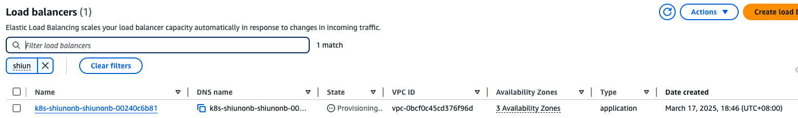

# 如何使用 ALB 暴露你的 EKS

Tags: AWS ALB, AWS EKS, AWS ELB, Kubernetes
Category: AWS, Kubernetes
Created time: March 17, 2025 4:17 PM
Last edited time: March 18, 2025 10:22 AM

[aws-load-balancer-controller 1.11.0 · helm/aws](https://artifacthub.io/packages/helm/aws/aws-load-balancer-controller)

[Route application and HTTP traffic with Application Load Balancers - Amazon EKS](https://docs.aws.amazon.com/eks/latest/userguide/alb-ingress.html)

> When you create a Kubernetes `ingress`, an AWS Application Load Balancer (ALB) is provisioned that load balances application traffic.
> 

## Q&A

- AWS Load Balancer Controller 會以什麼樣的形式存在在 K8s Cluster?
    
    Claude 3.7 Sonnet
    
    AWS Load Balancer Controller 在 Kubernetes (K8s) 叢集中是以 Deployment 的形式存在，具體來說它有以下特點：
    
    1. 它作為一個 Deployment 資源部署在 K8s 叢集中
    2. 通常部署在 kube-system 或專門的命名空間（如 aws-load-balancer-controller）
    3. 以 Pod 的形式運行，Pod 內包含 AWS Load Balancer Controller 的容器
    4. 使用 ServiceAccount 與相應的 RBAC 權限來管理 K8s 資源
    5. 監聽特定的 K8s 資源（如 Ingress, Service）並自動在 AWS 中創建和配置相應的負載均衡器
    
    AWS Load Balancer Controller 的主要功能是監聽 Kubernetes 中的變化，特別是 Ingress 和 Service 類型為 LoadBalancer 的資源，然後在 AWS 中自動創建和配置相應的 Application Load Balancer (ALB) 或 Network Load Balancer (NLB)，確保外部流量能夠正確路由到 K8s 叢集中的應用。
    
- [alb.ingress.kubernetes.io/healthcheck-path:](http://alb.ingress.kubernetes.io/healthcheck-path:) 老實說我不知道 Nginx 的健康檢查路徑
    
    Claude 3.7 Sonnet
    
    對於 Nginx，預設的健康檢查路徑可以简单设为 `/`，但这可能會導致每次健康檢查都載入完整頁面，這並不是最理想的方法。
    
    更好的做法是在你的 Nginx 配置中創建一個專門用於健康檢查的輕量級端點。例如，你可以在 Nginx 配置中添加：
    
    ```
    location /health {
        access_log off;
        return 200 "healthy\n";
    }
    
    ```
    
    然後在 Ingress 中設置:
    
    ```yaml
    alb.ingress.kubernetes.io/healthcheck-path: /health
    
    ```
    
    這樣 AWS ALB 就會檢查這個輕量級路徑，而不會加重你的應用負擔。
    
    如果你使用的是標準的 Nginx 映像而沒有自定義配置，那麼使用 `/` 路徑應該可以工作，但效率不是最佳。ALB 健康檢查會向這個路徑發送請求，如果收到 2xx 或 3xx 響應碼，就會認為服務是健康的。
    
    注意：如果你的 Nginx 設置了複雜的路由或認證，確保健康檢查路徑是可以無認證訪問的，否則健康檢查會失敗。
    
- 我很好奇，我在 ingress 那邊呀根本沒指定什麼 region，那 kubectl apply -f ingress.yaml 後，k8s 怎那麼聰明知道要建立 ALB 在哪個 AWS Region?
    
    # Claude 3.7 Sonnt
    
    這是個很好的問題！Kubernetes 本身並不知道要在哪個 AWS 區域建立 ALB，這個邏輯是由 AWS Load Balancer Controller 處理的。這裡是它如何工作的：
    
    當你部署 AWS Load Balancer Controller 到你的 Kubernetes 叢集時，你需要為它提供 AWS 憑證和配置。Controller 會在啟動時確定它需要操作的 AWS 區域，通常是通過以下幾種方式之一：
    
    1. **從 EC2 實例元數據獲取**：如果你的 Kubernetes 叢集運行在 EKS 或自管理的 EC2 實例上，Controller 會使用 EC2 實例元數據服務來確定當前的 AWS 區域。
    2. **從環境變數獲取**：部署 Controller 時可能設置了 `AWS_REGION` 或 `AWS_DEFAULT_REGION` 環境變數。
    3. **從 AWS SDK 配置獲取**：Controller 使用 AWS SDK，可能會從 `~/.aws/config` 或其他 AWS 配置來源獲取區域信息。
    4. **從 Controller 的部署配置獲取**：在 Helm chart 或 YAML 部署文件中，可能會明確設置 AWS 區域。
    
    基本原則是：AWS Load Balancer Controller 會在部署和配置時已經知道它應該操作哪個 AWS 區域，這樣當你應用 Ingress 資源時，它就已經知道應該在哪個區域創建 ALB。
    
    這正是 Kubernetes 運營商模式（Operator Pattern）的魅力所在 - 你只需要聲明你想要什麼（在這個例子中是一個 Ingress 資源），而專門的 Controller 會處理如何在特定的雲環境中實現它的所有細節。
    
    # ChatGPT 4o
    
    在 Kubernetes (k8s) 的 Ingress 設定中，你的 `ingress.yaml` 並不會直接指定 AWS Region，但 Kubernetes 之所以知道該在哪個 AWS Region 建立 ALB (Application Load Balancer)，是因為 **你的 EKS Cluster (或 Kubernetes cluster) 是建立在某個 AWS Region 上的**。
    
    ### 為什麼 Kubernetes 知道要在哪個 AWS Region 建立 ALB？
    
    1. **EKS Cluster 已經綁定 AWS Region**
        - 當你建立 EKS (Amazon Elastic Kubernetes Service) Cluster 時，你已經指定了 AWS Region。例如：
            
            ```
            aws eks create-cluster --region us-west-2 --name my-cluster ...
            
            ```
            
        - 這個 EKS Cluster 內的所有 AWS 相關資源 (像是 Load Balancer, EBS, IAM Policies) 都會在這個 Region 內建立。
    2. **Kubernetes 透過 AWS Load Balancer Controller 自動查詢 Region**
        - 當你在 `kubectl apply -f ingress.yaml` 時，EKS 內部的 **AWS Load Balancer Controller** 會自動解析該 Ingress 資訊，然後：
            1. 查詢該 EKS Cluster 所在的 AWS Region
            2. 在該 Region 自動建立對應的 ALB
        - 你可以透過 `kubectl get deployment -n kube-system aws-load-balancer-controller` 確認 AWS Load Balancer Controller 是否有運行。
    3. **透過 EKS Cluster 的 IAM Role 來存取 AWS 資源**
        - EKS Cluster 會使用指定的 IAM Role，這個 Role 的權限通常允許它管理 ELB/ALB。
        - 當 Ingress Controller 偵測到新的 Ingress 資源時，它會使用這個 IAM Role 來呼叫 AWS API，在 EKS Cluster 所在的 Region 建立 ALB。
    
    ### 你可以在哪裡看到 Region 設定？
    
    如果你想確認你的 Kubernetes Cluster 是在哪個 AWS Region，可以：
    
    ```
    aws eks describe-cluster --name my-cluster --query "cluster.resourcesVpcConfig.clusterSecurityGroupId" --region us-west-2
    
    ```
    
    或直接查詢 Cluster 的 Region：
    
    ```
    kubectl get nodes -o wide
    
    ```
    
    你會看到 Node (EC2) 是在哪個 AWS 可用區 (AZ)，也可以推斷出 Region。
    
    ---
    
    ### 結論
    
    當你 `kubectl apply -f ingress.yaml`，Kubernetes 之所以知道 ALB 要建在哪個 Region，是因為：
    
    1. **EKS Cluster 本身已經是 Region-Specific**，所有 AWS 資源都會在這個 Region 內建立。
    2. **AWS Load Balancer Controller 會自動偵測 EKS Cluster 的 Region，並在相應的 Region 內建立 ALB。**
    3. **EKS Cluster 的 IAM Role 已經有權限存取該 Region 內的 AWS 資源，讓 Controller 可以透過 AWS API 建立 ALB。**
    
    你不需要手動指定 Region，因為 EKS Cluster 本身已經決定了一切 🚀
    

## 前情提要

剛經歷了一波苦海 [踩坑紀錄 - 更新了 resources request，無法調度 pod](https://www.notion.so/resources-request-pod-1b9ea7e0d9d08068aec7df5f90a14fbf?pvs=21) [Karpenter 和 Pod 要怎麼設置，才可以讓 WorkerNode 開在不同 AZ，Pod 配在不同 Node](https://www.notion.so/Karpenter-Pod-WorkerNode-AZ-Pod-Node-1b9ea7e0d9d080fdb166c32a09044301?pvs=21) 

接下來我要用 ALB 暴露我的應用啦

其實之前在做 [[Workshop] **Amazon EKS Workshop - Fundamental**](https://www.notion.so/Workshop-Amazon-EKS-Workshop-Fundamental-1a1ea7e0d9d0805582acccbd4e3430c6?pvs=21) 有做到一點點，大概有個基本概念了，但是我希望我自己能夠去理解透徹這邊的原理深入一點

## 安裝 AWS Load Banlancer Controller 到集群

取自 Helm TL;DR:

```bash
helm repo add eks https://aws.github.io/eks-charts
# If using IAM Roles for service account install as follows -  NOTE: you need to specify both of the chart values `serviceAccount.create=false` and `serviceAccount.name=aws-load-balancer-controller`
helm install aws-load-balancer-controller eks/aws-load-balancer-controller --set clusterName=my-cluster -n kube-system --set serviceAccount.create=false --set serviceAccount.name=aws-load-balancer-controller
# If not using IAM Roles for service account
helm install aws-load-balancer-controller eks/aws-load-balancer-controller --set clusterName=my-cluster -n kube-system
```

我是沒安裝啦，因為我目前所在 Cluster 已經有前人安裝過了：

```bash
$ kubectl get deploy -n kube-system | grep aws-load

aws-load-balancer-controller             2/2     2            2           2y152d
```

## 建立 Ingress

這邊我會需要先拿到 Nginx 的 Service name

```bash
$ kubectl get svc

NAME          TYPE        CLUSTER-IP       EXTERNAL-IP   PORT(S)          AGE
shiun-nginx   ClusterIP   172.20.235.205   <none>        80/TCP,443/TCP   3d2h
```

然後來撰寫 `ingress.yaml`

```yaml
apiVersion: networking.k8s.io/v1
kind: Ingress
metadata:
  name: shiun-onboarding-alb
  namespace: shiun-onboarding
  annotations:
    alb.ingress.kubernetes.io/scheme: internet-facing
    alb.ingress.kubernetes.io/target-type: ip
    alb.ingress.kubernetes.io/healthcheck-path: /
spec:
  ingressClassName: alb
  rules:
    - http:
        paths:
          - path: /
            pathType: Prefix
            backend:
              service:
                name: shiun-nginx
                port:
                  number: 80
```

```bash
kubectl apply -f ingress.yaml
```

接著上去看 ALB Console，就會看到他正在創建了：



然後拿到 ALB 的 DNS Name，看到畫面！！

