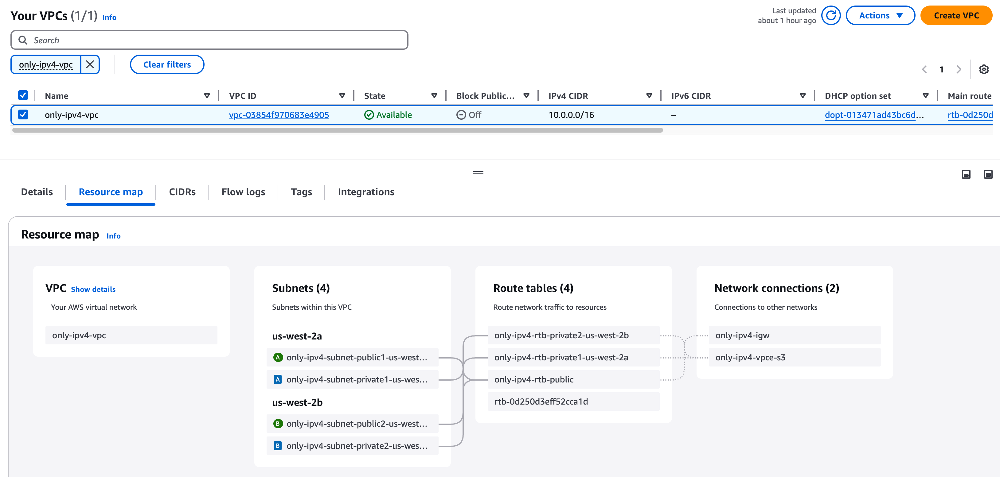

# 如何將現有 NLB IPv4-only 架構升級為 Dual-stack

Tags: AWS ELB, Dual-stack, Migration
Category: AWS, Migration, Networking
Created time: January 7, 2025 10:08 PM
Last edited time: January 8, 2025 10:31 PM

- [x]  Research how to upgrade an IPv4-only architecture to support Dual-stack — [如何將現有 NLB IPv4-only 架構升級為 Dual-stack](https://www.notion.so/NLB-IPv4-only-Dual-stack-174ea7e0d9d080e5b0e2cbe31f721c6a?pvs=21)


## 目標

這篇文章將講解，如何將一個現有的 IPv4-only 遷移到 Dual-stack 架構

## 現有架構

現在的架構是一個很基本的 NLB(Internet-facing) → TG (Instance type IPv4) 的架構

- VPC




- NLB
    - Details
        
        
        
    - Security Group
        
        
        
- Target Group
    - Instance
        
        
        
    - Security Group
        
        
        

# IPv4-only → Dual-stack

## VPC 新增 IPv6 CIDR


## 更新 NLB ENI 所處的 Subnet

可以到 NLB 的頁面找到他所處的 Subnet


點擊 Edit IPv6 CIDR


切一個 IPv6 CIDR 給這子網


## 更新 NLB IP address type

補充一下，更改 address type 前，可以去觀察一下 NLB 的 ENI，還沒有 IPv6 address


回到 NLB 的頁面 > Edit IP address type


改成 **Dual-stack**


回到 ENI 頁面，可以注意到，已經從 Subnet CIDR 中  Assign 一個 IPv6 address 給 NLB ENI 了


## 修改 NLB 的 Security Group 允許 IPv6 流量

可以從 NLB Detail 的頁面中 > Security，找到這個 NLB 的 SG (Security Group)


點擊 Edit inbound rules


點擊 **Add rule > 新增以下配置後 > Save rules**：

- **Type:** HTTP
- **Source:** Anywhere-IPv6
- **Description:** Allow all HTTP traffic (IPv6)


可以測試看看能不能把請求成功打進去 NLB 而且還得到回應

請把 `curl -6` 後面那串**換成你自己的 NLB domain name**

```bash
curl -6 http://nlb-from-ipv4-to-dual-stack-a7d193e605191856.elb.us-west-2.amazonaws.com
```

你會發現打不通，沒有回應！！

你會發現打不通，沒有回應！！

你會發現打不通，沒有回應！！

## 修改 Route table

為什麼上面會打不通呢？

- 上方指令，我強制使用 IPv6，所以我們是 IPv6 Client
- 因為 NLB 想要把流量打到外面去，但是路由表內並沒有匹配的 Route 允許他說「當目的地是 XXX IPv6 地址時，下一跳要給誰」
- 所以我們要修改 Route Table，NLB 才有辦法把流量送回來我們這裡

現在要來修改 NLB ENI 所處的 Subnet 其關聯的 Route table

在 NLB Detail 頁面中，點擊 **Availability Zones** 下方的**連結**，找到 NLB 所在的 Subnet


點擊 Route Table


勾選 **Route Table > Actions > Edit routes**


新增 route:

- Destination: `::/0`
- Target: Internet Gateway


再次發出 HTTP 請求

```bash
$ curl -6 http://nlb-from-ipv4-to-dual-stack-a7d193e605191856.elb.us-west-2.amazonaws.com

<h1>Hello World from ip-10-0-138-176.us-west-2.compute.internal</h1>
```

到這邊，其實已經完成一半了

### SSH 連線到 Target Group 的 Instance 觀察 Logs

我這邊有用跳板機，連線進去 Target Group 的 Instance 捕捉一下 Private IPv4 Instance 的 Apache httpd Logs，執行以下指令就可以查看 Logs:

```bash
sudo tail -f /var/log/httpd/access_log
```

一樣我先回到自己電腦，用 `curl` 命令對 NLB 發出請求:

```bash
curl -6 http://nlb-from-ipv4-to-dual-stack-a7d193e605191856.elb.us-west-2.amazonaws.com
```

然後回到 EC2 Instance 查看 httpd access logs，可以觀察到，來源地址是 NLB 的 Private IPv4 address (10.0.9.20)

```bash
10.0.9.20 - - [07/Jan/2025:20:49:00 +0000] "GET / HTTP/1.1" 200 69 "-" "ELB-HealthChecker/2.0"
10.0.9.20 - - [07/Jan/2025:20:49:02 +0000] "GET / HTTP/1.1" 200 69 "-" "curl/8.7.1"
```

透過這個觀察，我們可以知道，當我身為 IPv6 Client，向 NLB 發出 HTTP 請求後，當流量到達時 NLB ，NLB 會利用自身的 Private IPv4 address 去和 Target 通信，這也是為什麼我們在 EC2 Instance 觀察 httpd access log 時，看到的來源 IP 地址並不是我電腦的 IPv6 adrress，而是 NLB 的 Private IPv4 address。

當然我們也可以觀察用 IPv4 去調用，會怎樣

```bash
curl -4 http://nlb-from-ipv4-to-dual-stack-a7d193e605191856.elb.us-west-2.amazonaws.com
```

一樣回到 EC2 Instance 查看 httpd access log，觀察到這裡可以直接看見我電腦的 IPv4 address:

```bash
61.64.29.207 - - [08/Jan/2025:01:33:29 +0000] "GET / HTTP/1.1" 200 69 "-" "curl/8.7.1"
```

會這樣是因為流量從頭到尾都是 IPv4，NLB 不需要在中間幫我們做任何協議的轉換：

```bash
IPv4 Client -> Dual-stack NLB -> IPv4 Target Group Instance
```

### 利用 VPC Flow logs 觀察 NLB 的回應

VPC Flow Logs 的建置不是本文重點，關於怎麼建置在煩請查閱 AWS 官方文檔

此外我還建立的 VPC Flow logs 來看看 NLB 的 ENI，我觀察到以下東西：

- NLB 確實是以自身 IPv6 address 作為來源地址，將後端應用 (Target Group) 的 Response 回傳到我的電腦
- 為什麼 VPC Flow logs 上面沒見到任何我的筆電 IPv6 地址作為 src？只有看到我的筆電 IPv6 被作為 dst?? 可以看下圖
    
    ](image%2023.png)
    
    NLB IPv6 address: 2600:1f14:2549:300:17c1:6c5d:ba29:ce1, My IPv6 address: [**2407:4b00:1c02:77d9:8041:f560:157a:c42c**](https://whatismyipaddress.com/ip/2407:4b00:1c02:77d9:8041:f560:157a:c42c)
    
    
    
    NLB IPv6 address: 2600:1f14:2549:300:17c1:6c5d:ba29:ce1
    
    - 其實即便我今天是 IPv4 Client 也是一樣，就是看不到我的 IP 地址被作為 src 記錄在 VPC Flow logs
    - ChatGPT4o 對於發生此情況的的推測如下
        - Prompt
            
            我想知道背後到底是什麼行為？？
            我現在雲端架構是是 Dual-stack NLB -> IPv4-only EC2
            我是 IPv6 Client，打 HTTP 請求到 Dual-stack NLB 一切都很正常，順利收到  IPv4-only EC2 的Response了
            
            但是我心血來潮，打開 VPC Flow logs 觀測 NLB 的 ENI
            為什麼我身為 IPv6 Client 打了 NLB 的 Domain name，照理來說相當於直接打流量到 NLB 的 ENI 上，那為什麼 VPC Flow logs 上面沒見到任何我的筆電 IPv6 地址作為 src？只有看到我的筆電 IPv6 被作為 dst?? 我的重點著重在 VPC Flow logs 為什麼沒紀錄我筆電打過去的流量？
            
        1. **NLB 的流量處理機制**：
            - **入站流量**：當您的筆電（IPv6 客戶端）向 NLB 發送請求時，NLB 的 ENI 接收到這些 IPv6 封包。然而，NLB 可能在內部處理這些封包，直接將其轉發給後端目標，而不經過其 ENI 的完整網路堆疊。這可能導致 Flow Logs 未能捕捉到這些入站封包的來源地址。
            - **出站流量**：當後端目標回應時，NLB 需要將回應發送回您的筆電（IPv6 客戶端）。這些回應封包可能經過 NLB 的 ENI 發出，因此在 Flow Logs 中顯示您的筆電 IPv6 地址作為目標地址（`dst`）。
        2. **VPC Flow Logs 的記錄範圍**：
            - **記錄限制**：VPC Flow Logs 記錄的是網路介面（ENI）層級的流量資訊。如果某些流量在 NLB 的內部處理過程中未經過 ENI，或者經過特殊的封包處理路徑，這些流量可能不會被 Flow Logs 捕捉到。
        3. **NLB 的架構特性**：
            - **內部優化**：為了提高效能，NLB 可能對入站和出站流量採取不同的處理路徑。入站流量可能直接路由到後端目標，而出站流量則可能經過 ENI 發出，導致 Flow Logs 中僅顯示出站流量的相關資訊。

到這裡，其實已經算是完成了，但如果你想要讓後端也變成 Dual-stack，那就繼續往下做！

# 為你的 Target Group 也新增 IPv6 address

## 分配 IPv6 CIDR 給 Target Group 的 Instance 所處 subnet

進入 EC2 頁面，找到這台 EC2 所處的 Subnet


**選取 Subnet > Edit IPv6 CIDR**


分配一個 `/64` 的 IPv6 CIDR 子網給他

注意，配給這個子網的 CIDR 不要和別的子網 CIDR 有 Overlapping! 


## Assign IPv6 address 給 Instance

**選取 Instance > Actions Menu > Networking > Manage IP addresses**


展開 eth0 > 在 IPv6 addresses 的 Section 下 > Click Assign new IP address，欄位可以不填寫，他會從子網的 IPv6 CIDR 中 Auto-assign


## 建立 IPv6 Instance type target group

進入 EC2 > Target Group 頁面，建立新的 Target Group

- Target type: Instances
- Target group name: ipv6-private-instance-tg
- Protocol: Port
    - TCP
    - 80
- **IP address type: IPv6**
- VPC: Instance 所處的 VPC

其他保持預設，然後按下 Next


**點擊 Unassigned > Manage IP addresses**


展開 eth0 > Enable Assign primary IPv6 IP > Save


回到剛才 Target Group 的頁面，Refresh


勾選 **instance > Include as pending below > Create target group**


## 修改 NLB Listener 的 Target

**進入 NLB Detail 頁面 > 勾選 Listener > Edit listener**


選取剛才所創建的 IPv6 Target Group


切換 TG 後，需要等一下下，因為 NLB 還要做 Health Check 需要一點時間

這時候我回到先前所 SSH 連線的 EC2 Instance 持續觀察 httpd access log 也會發現 Health check 的流量，從原本的 NLB Private IPv4 address 變成 NLB IPv6 address!


## 測試流量

一樣我們來試試看 `curl -6` 指令向目前已經是 Dual-stack 的 NLB 發出 HTTP 請求：

```bash
curl -6 http://nlb-from-ipv4-to-dual-stack-a7d193e605191856.elb.us-west-2.amazonaws.com
```

流量會是:

```bash
IPv6 Client -> Dual-stack NLB -> IPv6 Target Group Instance
```

因為全程都是 IPv6，NLB 是協議透明的，所以 Target Group 中 Instance 是可以直接看到 Client IP address，以下是我 httpd access log， `2407:4b00:1c02:77d9:8041:f560:157a:c42c`  是我這台筆電的 IPv6 address

```bash
2407:4b00:1c02:77d9:8041:f560:157a:c42c - - [07/Jan/2025:22:01:05 +0000] "GET / HTTP/1.1" 200 69 "-" "curl/8.7.1"
```

然後也來試試看 IPv4 Client 去發出 HTTP 請求：

```bash
curl -4 http://nlb-from-ipv4-to-dual-stack-a7d193e605191856.elb.us-west-2.amazonaws.com
```

你會發現後端看到的來源 IP 是 NLB 的 IPv6 address

```bash
2600:1f14:2549:300:17c1:6c5d:ba29:ce1 - - [08/Jan/2025:02:08:26 +0000] "GET / HTTP/1.1" 200 69 "-" "curl/8.7.1"
```

### 既然 NLB 會幫我做協議轉換，那我還是想看到原始客戶端 IP 地址怎麼辦？

這時候就需要 Proxy Protocol 的幫助了！

詳情請見 [配置 Nginx 支持 Proxy Protocol v2](https://www.notion.so/Nginx-Proxy-Protocol-v2-173ea7e0d9d0802f892ce2b62c8fcd9f?pvs=21) 

## 特殊紀錄

我做到 [測試流量](https://www.notion.so/174ea7e0d9d0803abe8bf975c5cc2335?pvs=21) 時，突然看到這個 log


```bash
2600:1f14:2549:300:17c1:6c5d:ba29:ce1 - - [07/Jan/2025:22:00:11 +0000] "GET / HTTP/1.0" 200 69 "-" "Expanse, a Palo Alto Networks company, searches across the global IPv4 space multiple times per day to identify customers&#39; presences on the Internet. If you would like to be excluded from our scans, please send IP addresses/domains to: scaninfo@paloaltonetworks.com"
```

## Resources

[VPC CIDR blocks - Amazon Virtual Private Cloud](https://docs.aws.amazon.com/vpc/latest/userguide/vpc-cidr-blocks.html)