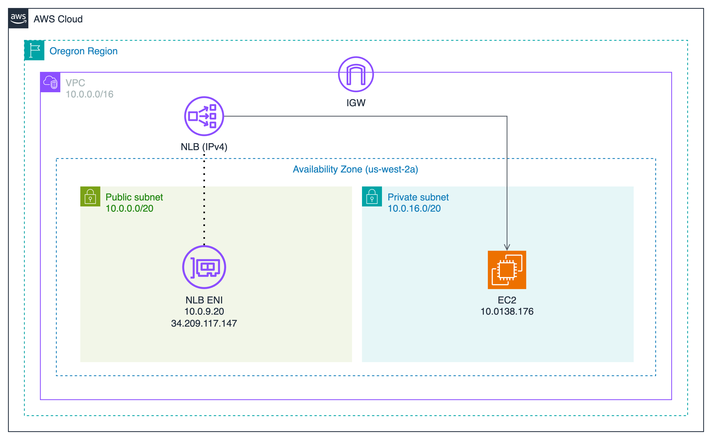

## 目標

- 將現有的 IPv4-only NLB 升級為支援 dual-stack
- 讓 Target Group 從純 IPv4 轉換為支援 IPv6
- 確保整個架構能同時處理 IPv4 和 IPv6 的流量

我們將逐步完成這個轉換過程，包括配置 VPC、更新 NLB 設置、修改 security groups，以及設定 target groups。每個步驟都會提供詳細的操作說明和技術細節，幫助您順利完成這個升級過程。

---

## 現有架構

現在的架構是一個很基本的 IPv4 NLB(Internet-facing) → Target Group (IPv4 Instance type ) 的架構

<!-- markdownlint-disable -->




- VPC
    
    

- NLB
  - Details
      
  - Security Group
      

- Target Group
  - Instance
      
  - Security Group
      


<!-- markdownlint-restore -->

---

## Section 1: NLB IPv4 → Dual-stack

### Step 1: VPC 新增 IPv6 CIDR

進入 VPC 頁面：

1. 選取 **VPC**
2. 展開 **Actions menu**
3. 點擊 **Edit CIDRs**


新增 IPv6 CIDR：

1. 點擊 **Add new IPv6 CIDR**
2. 選擇 **Amazon-provided IPv6 CIDR block**


### Step 2: 為 NLB ENI 所處的 Subnet 分配 IPv6 CIDR

在 AWS Console 常常都會迷路，要配置的東西很多，又散亂在不同地方，所以我習慣到 NLB 的頁面直接找到他所處的 Subnet，如下圖，可以看到 NLB Details 頁面中有一個 **Availability Zones 的地方下面的連結就是 Subnet 連結**


成功進入 Subnet Details 頁面後：

1. 展開 **Actions menu**
2. 點擊 **Edit IPv6 CIDRs**


從 VPC CIDR 中，切一個 `/64` 的 IPv6 CIDR 給這 Subnet


### Step 3: 更新 NLB IP address type

當 NLB 所在的 Subnet 已經分配了 IPv6 CIDR 範圍時，可以為 NLB 的 ENI 分配 IPv6 address。不過，NLB 的 ENI 是由 AWS 自動管理，我們無法直接操作或管理這些 ENI。**要為 NLB 的 ENI 分配 IPv6 address，需要修改 NLB 的 IP address type**，例如將其設定為 `dualstack`，AWS 會自動為 ENI 分配對應的 IPv6 位址。

更改 NLB address type 前，可以去觀察一下 NLB 的 ENI，確實還沒有 IPv6 address (下圖紅框所示)


回到 NLB Details 頁面：

1. 展開 **Actions menu**
2. 點擊 **Edit IP address type**


把 Load balancer IP address type 改成 **Dualstack**


再次回到 ENI 頁面，再次觀察 NLB 的 ENI ，可以注意到，已經從 Subnet CIDR 中  Assign 一個 IPv6 address 給 NLB ENI 了 (下圖紅框處)


### Step 4: 修改 NLB 的 Security Group 允許 IPv6 流量

我們的 NLB 是 Internet-facing 的，原本的 Security Group 只允許任何來源的 IPv4 流量，但我們要接收 IPv6 Client 的流量，勢必就需要修改 Security Group 以允許 IPv6 的流量進入 NLB。

要找到他的 Security Group：

- 可以進入 NLB Detail 的頁面中 > Security 頁籤
- 就可以找到這個 NLB 的 SG (Security Group)


進入 Security Group 頁面：

1. 點擊 Edit inbound rules


配置 Inbound rule 允許 IPv6 流量：

1. 點擊 **Add rule**
2. **Type:** HTTP
3. **Source:** Anywhere-IPv6
4. **Description:** Allow all HTTP traffic (IPv6)


現在可以測試看看能不能把請求成功打進去 NLB 而且還得到回應， `curl -6` 是 `curl` 工具的一個選項，專門用於指定使用 **IPv6** 進行請求，如果要用 IPv4 進行請求就是用 `-4`

請把 `curl -6` 後面那串**換成你自己的 NLB domain name**

請把 `curl -6` 後面那串**換成你自己的 NLB domain name**

請把 `curl -6` 後面那串**換成你自己的 NLB domain name**

```bash
curl -6 http://nlb-from-ipv4-to-dual-stack-a7d193e605191856.elb.us-west-2.amazonaws.com
```

你會發現打不通，沒有回應！！

你會發現打不通，沒有回應！！

你會發現打不通，沒有回應！！

### Step 5: 修改 Route table 以允許 IPv6 流量出去

為什麼剛才發出 HTTP 請求後得不到回應呢？原因是：

- 上方指令，我強制使用 IPv6，所以我們是 IPv6 Client
- 因為 NLB 想要把流量打到外面去，但是路由表內並沒有匹配的 Route 允許他說「當目的地是 XXX IPv6 地址時，下一跳要給誰」
- 所以我們要修改 Route Table，NLB 才有辦法把流量送回來我們這裡

所以！！現在要來修改 NLB ENI 所處的 Subnet 其關聯的 Route table，確保其有 `::/0` 相關的規則，讓 IPv6 流量可以出去 VPC

進入 NLB Detail 頁面中，點擊 **Availability Zones** 下方的**連結**，找到 NLB 所在的 Subnet


進入 VPC Subnets Details 頁面點擊 **Route Table**


進入 Route table 頁面：

1. 勾選 **Route Table**
2. 展開 **Actions menu**
3. 點擊 **Edit routes**


新增 route:

- **Destination:** `::/0`
- **Target**: Internet Gateway


改好後，再次發出 HTTP 請求

```bash
$ curl -6 http://nlb-from-ipv4-to-dual-stack-a7d193e605191856.elb.us-west-2.amazonaws.com

<h1>Hello World from ip-10-0-138-176.us-west-2.compute.internal</h1>
```

太棒了！！終於收到 Response 了，到這邊，**其實可以算是遷移到 Dual-stack 的目標完成一半了！**

但是我要追求的是 Fully dual-stack! 也就是 Target Group 那邊也是要 Dual-stack

### (Optional) SSH 連線到 Target Group 的 Instance 觀察 Logs

我這邊有用跳板機，連線進去 Target Group 的 Instance 捕捉一下 Private IPv4 Instance 的 Apache httpd Logs，執行以下指令就可以查看 Logs：

```bash
sudo tail -f /var/log/httpd/access_log
```

一樣我先回到自己電腦，用 `curl` 命令對 NLB 發出請求：

```bash
curl -6 http://nlb-from-ipv4-to-dual-stack-a7d193e605191856.elb.us-west-2.amazonaws.com
```

然後回到 EC2 Instance 查看 httpd access logs，可以觀察到，來源地址是 NLB 的 Private IPv4 address (10.0.9.20):

```bash
10.0.9.20 - - [07/Jan/2025:20:49:00 +0000] "GET / HTTP/1.1" 200 69 "-" "ELB-HealthChecker/2.0"
10.0.9.20 - - [07/Jan/2025:20:49:02 +0000] "GET / HTTP/1.1" 200 69 "-" "curl/8.7.1"
```

透過這個觀察，我們可以知道，當我身為 IPv6 Client，向 NLB 發出 HTTP 請求後，當流量到達時 NLB ，**NLB 會利用自身的 Private IPv4 address 去和 Target 通信**，這也是為什麼我們在 EC2 Instance 觀察 httpd access log 時，看到的來源 IP 地址並不是我電腦的 IPv6 address，而是 NLB 的 Private IPv4 address。

當然我們也可以觀察用 IPv4 去調用，會怎樣：

```bash
curl -4 http://nlb-from-ipv4-to-dual-stack-a7d193e605191856.elb.us-west-2.amazonaws.com
```

一樣回到 EC2 Instance 查看 httpd access log，觀察到這裡**可以直接看見我電腦的 IPv4 address**:

```bash
61.64.29.207 - - [08/Jan/2025:01:33:29 +0000] "GET / HTTP/1.1" 200 69 "-" "curl/8.7.1"
```

會這樣是因為流量從頭到尾都是 IPv4，NLB 不需要在中間幫我們做任何協議的轉換：

```bash
IPv4 Client -> Dual-stack NLB -> IPv4 Target Group Instance
```

### (Optional) 利用 VPC Flow logs 觀察 NLB 的回應

> VPC Flow Logs 的建置不是本文重點，關於怎麼建置在煩請查閱 [AWS 官方文檔](https://docs.aws.amazon.com/vpc/latest/userguide/flow-logs.html)

我建立了 VPC Flow logs 來觀察 NLB 的 ENI，於是觀察到以下東西：

- NLB 確實是以自身 IPv6 address 作為來源地址，將後端應用 (Target Group) 的 Response 回傳到我的電腦
- 為什麼 VPC Flow logs 上面沒見到任何我的筆電 IPv6 地址作為 src？只有看到我的筆電 IPv6 被作為 dst?? 可以看下圖
  - 其實即便我今天是 IPv4 Client 也是一樣，就是看不到我的 IP 地址被作為 src 記錄在 VPC Flow logs
  - 這個問題真的讓我很匪夷所思，想了很久，只能**猜測：**某些流量在 NLB 的內部處理過程中未經過 ENI，或者經過特殊的封包處理路徑，這些流量可能不會被 Flow Logs 捕捉到。 (純屬猜測，如果有人知道正確答案希望能分享讓我知道，真的很想探究背後的原因)

  ](image%2023.png)

  > NLB IPv6 address: 2600:1f14:2549:300:17c1:6c5d:ba29:ce1
  > My IPv6 address: 2407:4b00:1c02:77d9:8041:f560:157a:c42c

  

---

## Section2: 讓 Target Group 也變成 Dual-stack

### Step 1: 分配 IPv6 CIDR 給 Target Group 的 Instance 所處 subnet

要找到 EC2 所處的 Subnet，我習慣進入 EC2 頁面，直接找到這台 EC2 所處的 Subnet


進入 VPC Subnet 頁面：

1. 選取 **Subnet**
2. 展開 **Actions menu**
3. 點擊 **Edit IPv6 CIDR**


從 VPC 中分配一個 `/64` 的 IPv6 CIDR 子網給他

**注意：**配給這個子網的 CIDR 不要和同 VPC 中的其他 Subnet CIDRs 有 Overlapping!


### Step2: Assign IPv6 address 給 Instance

進入 EC2 頁面：

1. 選取 **Instance**
2. 展開 **Actions Menu**
3. 點擊 **Networking**
4. 點擊 **Manage IP addresses**


Assign IPv6 Address:

1. 展開 **eth0**
2. 在 IPv6 addresses 的 Section 下，點擊 **Assign new IP address，欄位可以不填寫**，他會從子網的 IPv6 CIDR 中 Auto-assign


### Step 3: 建立 IPv6 Instance type target group

進入 EC2 > Target Group 頁面：

1. 點擊 **Create Target Group**

依照下方配置 Target Group

- **Target type:** Instances
- **Target group name:** ipv6-private-instance-tg
- **Protocol:** Port
  - TCP
  - 80
- **IP address type: IPv6**
- **VPC:** Instance 所處的 VPC

其他保持預設，然後按下 Next


**Register targets:**

1. **點擊 Unassigned**
2. **Manage IP addresses**


成功進到 **Manage IP addresses** 頁面：

1. 展開 **eth0**
2. 勾選 **Enable Assign primary IPv6 IP**
3. 點擊 **Save**


回到剛才 Target Group 的頁面：

1. 點擊右上角 Refresh icon (如下圖紅框所示)
2. 成功的話，你會看到表格中 **Primary IPv6 address 欄位從原本的** **Unassigned 變成顯示對應的 IPv6 address**


Register targets:

1. 勾選 **instance**
2. 點擊 **Include as pending below**
3. 點擊 **Create target group**


### Step 4: 修改 NLB Listener 的 Target

在 NLB 中，**一個 Listener（例如 TCP 80 Port Listener）背後只能關聯一個 Target Group，無法同時直接關聯多個 Target Group。**

要跟上趨勢當然就要用 IPv6，所以就來把原本的 IPv4 Target 改成剛才創建好的 IPv6 Target

**進入 NLB Detail 頁面：**

1. 勾選 **Listener**
2. 點擊 **Edit listener**


修改成剛才所創建的 IPv6 Target Group


切換 TG 後，需要等一下下，因為 NLB 還要做 Health Check 需要一點時間

這時候我回到先前所 SSH 連線的 EC2 Instance 持續觀察 httpd access log 也會發現 Health check 的流量，從原本的 NLB Private IPv4 address 變成 NLB IPv6 address

> 補充：
> 這是目前 NLB ENI 被 Assign 的 Addresses
> NLB Private IPv4 address: `10.0.9.20`
> NLB IPv6 address: 2600:1f14:2549:300:7935:fbac:a7b4:84d5


到這裡，我們已經成功把 Target Group 升級成 Dual-stack 了！

### Step 5: 測試 IPv6 流量

現在我們來使用 `curl -6` 指令向 Dual-stack NLB 發出 HTTP 請求：

```bash
curl -6 http://nlb-from-ipv4-to-dual-stack-a7d193e605191856.elb.us-west-2.amazonaws.com
```

流量路徑會是：

```bash
IPv6 Client -> Dual-stack NLB (Layer 4) -> IPv6 Target Group Instance
```

NLB 運作於第 4 層（傳輸層），專門處理傳輸層協議（如 TCP 和 UDP）的流量。由於 NLB 不會對應用層數據進行處理，因此它可以保留封包的原始來源 IP 地址，使後端 Target Group（例如 EC2 Instances）能直接看到 Client 的 IP 地址。

但是要注意，不同的 Target Group 配置會讓保留原始 Client IP 行為略有不同：

1. Target Group 使用實例 ID（Instance ID）：
NLB 會直接保留原始的 Client IP 地址，無需額外設定。
2. Target Group 使用 IP 地址（IP Address）：
如果使用的是 TCP 或 TLS 協議，NLB 預設不會保留 Client IP 地址。在這種情況下，可以啟用 Proxy Protocol v2，以將原始的 Client IP 地址嵌入到傳遞給目標的封包中。

以下是 Target Instance 上 httpd 的 access log，可以看到記錄的是客戶端的 IPv6 地址 `2407:4b00:1c02:77d9:8041:f560:157a:c42c` (這就是我電腦的 IPv6 address):

```bash
2407:4b00:1c02:77d9:8041:f560:157a:c42c - - [07/Jan/2025:22:01:05 +0000] "GET / HTTP/1.1" 200 69 "-" "curl/8.7.1"
```

也來試試看 IPv4 Client 發出 HTTP 請求：

```bash
curl -4 http://nlb-from-ipv4-to-dual-stack-a7d193e605191856.elb.us-west-2.amazonaws.com
```

你會發現後端看到的來源 IP 是 NLB 的 IPv6 address

```bash
2600:1f14:2549:300:17c1:6c5d:ba29:ce1 - - [08/Jan/2025:02:08:26 +0000] "GET / HTTP/1.1" 200 69 "-" "curl/8.7.1"
```

### (Optional) 既然 NLB 會幫我做協議轉換，那我還是想看到原始客戶端 IP 地址怎麼辦？

這時候就需要 Proxy Protocol 的幫助了！

由於這部分不是本文重點，要怎麼在配置 Proxy Protocol 來讓你的 Server 支援 Proxy Protocol 可以參考我的 Notion 筆記，但我這個筆記中是以 Nginx 為示範，跟本文使用 Httpd 不一樣唷：
- 連結：[配置 Nginx 支持 Proxy Protocol v2](https://www.notion.so/Nginx-Proxy-Protocol-v2-173ea7e0d9d0802f892ce2b62c8fcd9f?pvs=21)

> 若之後有時間我會重新整理 Notion 筆記中的 Proxy Protocol 的配置，再上傳到部落格

---

## Resources

- [VPC CIDR blocks - Amazon Virtual Private Cloud](https://docs.aws.amazon.com/vpc/latest/userguide/vpc-cidr-blocks.html)
- [Logging IP traffic using VPC Flow Logs - Amazon Virtual Private Cloud](https://docs.aws.amazon.com/vpc/latest/userguide/flow-logs.html)
- [配置 Nginx 支持 Proxy Protocol v2 - Shiun Notion](https://www.notion.so/Nginx-Proxy-Protocol-v2-173ea7e0d9d0802f892ce2b62c8fcd9f?pvs=21)
- [如何將現有 NLB IPv4-only 架構升級為 Dual-stack - Shiun Notion](https://shiun.notion.site/NLB-IPv4-only-Dual-stack-174ea7e0d9d080e5b0e2cbe31f721c6a?pvs=4)
- [Dual-stack network design in AWS - Shiun Notion](https://shiun.notion.site/Dual-stack-network-design-in-AWS-173ea7e0d9d080988482c722081d37dc?pvs=4)
- [Dual-stack IPv6 architectures for AWS and hybrid networks | Amazon Web Services](https://aws.amazon.com/tw/blogs/networking-and-content-delivery/dual-stack-ipv6-architectures-for-aws-and-hybrid-networks/)
